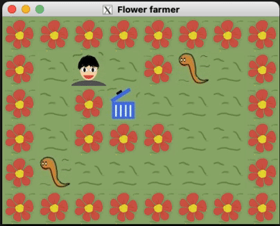

# Flower Farmer: The Garden Defender

**"Protect Your Blooms, Harvest the Pests!"**



## About The Game

In the serene world of Flower Farmer, your tranquil garden is under siege by hungry caterpillars looking to feast on your cherished flowers. As the guardian of the garden, it's your mission to gather these pesky intruders and dispose of them in the trash bin before they can do any harm. Remember, the goal is only achieved once every single caterpillar has been collected. Can you save your garden from these voracious visitors?

## Customizable Gameplay

Flower Farmer allows you to set different maps by passing a `.bar` file as the second argument when running the game. This feature enables a variety of gameplay experiences on numerous custom maps created by you or the community.

```bash
# Run the game with a custom map
./Flower_farmer maps/your_custom_map.bar
```

## Getting Started

To play Flower Farmer on macOS, you'll need to install XQuartz, as it relies on this to run properly. You can download XQuartz from [here](https://www.xquartz.org/).

Once XQuartz is installed, follow these steps to get the game up and running:

```bash
# Clone the repository
git clone https://github.com/syomakudo/Flower_farmer.git

# Navigate to the game directory
cd Flower_farmer

# Compile the game
make

# Run the game
./Flower_farmer maps/sample.bar
```

## Features and Technologies

- **Custom Maps**: Play on a variety of maps by specifying different `.bar` files.
- **Reimplemented Functions**: `get_next_line` and `ft_printf` are meticulously re-coded to mirror the functionality of their original counterparts, ensuring precise control over input and output operations.
- **Original Artwork**: All in-game graphics are originally crafted, providing a unique and charming visual experience.
- **Robust Error Handling**: The game employs stacks and depth-first search algorithms to validate that all items can be collected and the goal is achievable. It also rigorously checks for proper map enclosure, correct player and goal counts, and other potential errors.
